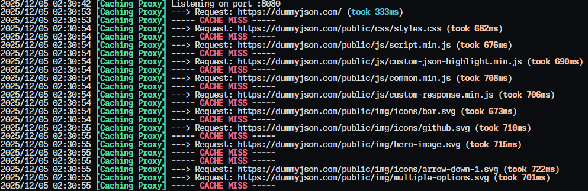
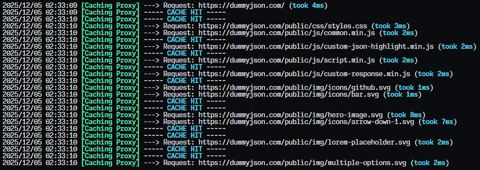
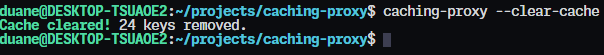
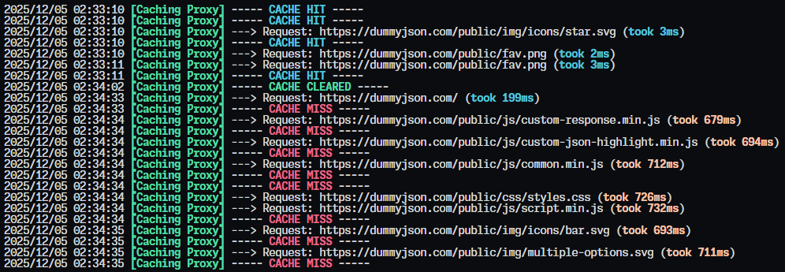

# Caching Proxy


A small Go HTTP proxy that forwards requests to an origin server and caches the responses in Redis. Helps speed up repeated requests and reduce load on the backend.

This project was built as part of the **Backend Developer Roadmap** projects from [roadmap.sh](https://roadmap.sh).

**Project URL**: [https://roadmap.sh/projects/caching-server](https://roadmap.sh/projects/caching-server)

## Prerequisites

Ensure [**Redis**](https://redis.io/downloads) is installed and running locally on the default port (6379). Redis is used by this application for caching. 
If you prefer not to install Redis directly, you can run it in **Docker**:

```bash
docker run -p 6379:6379 redis
```

## Installation

1. Install [Go 1.25.3+](https://go.dev/dl/) and verify:

```bash
go version
```

2. Install the binary:

```bash
go install github.com/duanechan/caching-proxy/cmd/caching-proxy@latest
```

3. Verify installation by running:

```bash
caching-proxy -h
```

## Usage

Run the proxy with an origin server and port:

```
caching-proxy --origin https://dummyjson.com --port 8080
```

_On open_



_On reload_



Clear Redis cache
```
caching-proxy --clear-cache
```

_In another terminal..._



_In the running instance..._




## Acknowledgements

Built as part of the **Backend Developer Roadmap** projects: [roadmap.sh](https://roadmap.sh/projects/caching-server)
